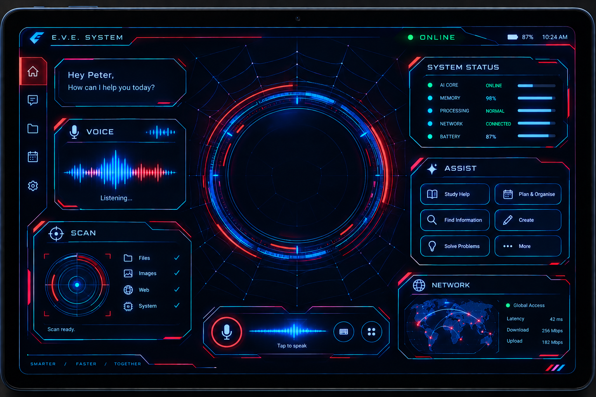

# E.V.E. SYSTEM // SPIDER-MAN: BRAND NEW DAY HUD

A futuristic, high-tech AI Assistant interface inspired by **Spider-Man: Brand New Day**, modeled after the `Ev.png` interface mockup.



---

## 🌟 Key Features

### 1. 🕷️ Visual Design & Faithful Mockup Parity
- **Tablet HUD Bezel**: Dark sci-fi hardware frame with ambient glows, scanline overlay, and status LED.
- **Spider-Web Arc Reactor Core**: Concentric holographic rotating rings with counter-rotating tick tracks, cyan and red laser arcs, and an interactive pulsating Spider-Sense core.
- **Color Scheme**: Neon electric cyan (`#00f0ff`), deep web-blue (`#0072ff`), Spider crimson (`#ff1244`), and online neon green (`#00ff88`).

### 2. ⚡ Real-Time Groq AI Integration
- Powered by ultra-fast Groq LPU models (`groq/compound`, `openai/gpt-oss-120b`, `qwen/qwen3.8-27b`).
- Pre-configured with the user-provided Groq API key: `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`.
- Authentic **E.V.E. Persona**: Tailored specifically for Peter Parker (Spider-Man), offering tactical combat advice, web-fluid chemistry assistance, suit diagnostics, and Midtown High study support.
- Live typewriter streaming text rendering with interactive neural terminal (`Communications` view).

### 3. 🎙️ Authentic Audio & Voice Synthesis
- **Fish Audio Voice Integration**:
  - Integrated with **Liam's E.V.** audio sample (`a2eaac4c2e1040c09be1257675c8c8c8`) from [Fish Audio Discovery](https://fish.audio/discovery/?q=E.v).
  - Pre-cached offline files: `audio/ev_liam.mp3`, `audio/ev_brand_new_day.mp3`, `audio/ev_danu_anomalies.mp3`, and `audio/ev_klay_anomalies.mp3`.
- **Real-Time Canvas Visualizers**:
  - **Voice Card**: Dual mirrored audio equalizer with dynamic frequency analysis and center laser guide.
  - **Voice Dock**: Live pulsating waveform bar with "Tap to speak".
- **Speech-to-Text (Voice Recognition)**:
  - Click the microphone button to talk directly to E.V.E. via the Web Speech API.
- **Dynamic Speech Synthesis (TTS)**:
  - Browser speech synthesis with pitch/tempo tuning for reading out live responses.
- **Web Audio API Sound Effects**:
  - Custom synthesized sci-fi click, scan, ping, and alert sound effects.

### 4. 🎯 Interactive HUD Subsystems
- **SCAN Card**:
  - 360-degree rotating radar sweep with target anomalies and multi-sector checkbox diagnostics (Files, Images, Web, System).
- **ASSIST Quick Actions**:
  - One-click tactical commands: `Study Help`, `Plan & Organise`, `Find Information`, `Create`, `Solve Problems`, and `More`.
- **SYSTEM STATUS**:
  - Live fluctuating telemetry for AI Core, Memory (98%), Processing (Normal), Network (Connected), and Battery (87%).
- **NETWORK Map**:
  - 3D vector world map with animated bezier connection arcs and photon packet transmission between NYC base and global satellites.
- **Navigation Rail**:
  - Instant navigation between **Home Dashboard**, **Neural Chat Terminal**, **Anomaly Scanner**, **Patrol Schedule**, and **System Settings**.

---

## 🚀 Getting Started

### Quick Start with Node.js
```bash
# Start the local server
node server.js
```
Then open your browser at:
👉 **[http://localhost:3000](http://localhost:3000)**

### Or Open Directly
You can also directly open `index.html` in any modern web browser (Google Chrome, Edge, Firefox, Brave).
